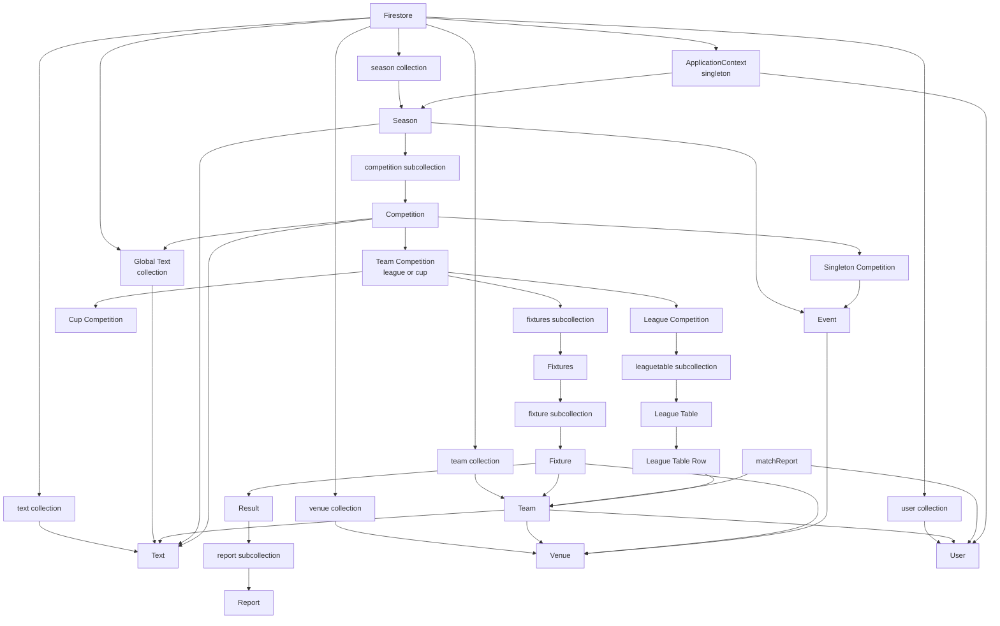

# Chiltern Quiz League Data Model

Source: `product_spec.md`

This document captures the product data model for the Chiltern Quiz League website. Non-singleton entities use UUID identifiers for their canonical document or record IDs. Singleton configuration documents may use stable semantic IDs.

## Entity Relationships

## Type Conventions

| Type            | Meaning                                                                                                        |
| --------------- | -------------------------------------------------------------------------------------------------------------- |
| `UUID`          | Canonical identifier for a non-singleton entity, usually the Firestore document ID.                            |
| `string`        | Plain text string.                                                                                             |
| `integer`       | Whole number.                                                                                                  |
| `boolean`       | True or false value.                                                                                           |
| `LocalDate`     | Date displayed in localised form without timezone information.                                                 |
| `LocalTime`     | Time-of-day value without date or timezone.                                                                    |
| `Duration`      | Length of time.                                                                                                |
| `Timestamp`     | Firestore timestamp or equivalent UTC instant used for freshness metadata, not for visitor-facing local dates. |
| `Text`          | Top-level structured text document with MIME type and body. Text is never embedded.                            |
| `Reference<T>`  | Firestore document reference or equivalent typed reference to another entity.                                  |
| `Map<K, V>`     | Key/value map.                                                                                                 |
| `array<T>`      | Embedded ordered array of values inside a document.                                                            |
| `collection<T>` | Nested or top-level collection of entities.                                                                    |

## Public Competition Browse Access

The Competitions public visitor feature reads the canonical data model directly. Whole-document read-only access is safe for these existing document paths:

- `season/{seasonId}`
- `season/{seasonId}/competition/{competitionId}`
- `season/{seasonId}/competition/{competitionId}/fixtures/{fixturesId}`
- `season/{seasonId}/competition/{competitionId}/fixtures/{fixturesId}/fixture/{fixtureId}`
- `season/{seasonId}/competition/{competitionId}/leaguetable/{tableId}`
- `team/{teamId}`
- `venue/{venueId}`
- `globalText/site`
- referenced `text/{textId}` documents

This public read contract is read-only and does not make `users`, team user subcollections, `ApplicationContext`, match report bodies, private maintenance collections, raw AI/provider data, credentials, or admin-only data public. It also does not add competition season index, competition season summary, or competition summary documents. Public text rendering must resolve references to top-level `text/{textId}` documents rather than embedding text bodies inside other documents.

## Public Team Browse Access

The Teams public visitor browse feature reads active public team documents directly from `team/{teamId}`. The Teams browse repository must query with `retired == false` and `limit(500)`; documents must also be audited for unauthenticated Teams rendering before they are published. Public team browse reads do not include team user subcollections, referenced `User` documents, standings, fixture/result aggregation, or team-detail data owned by later Team detail features.

Public competition pages have an existing bounded team-name resolution read contract on the same `team` collection. They may continue to read bounded public team-name data needed for historical competitions and do not use the Teams browse requirement to exclude retired teams from competition results, fixtures, or tables. Firestore rules preserve both bounded query shapes and deny unbounded or over-limit `team` list queries. Because Firestore rules cannot distinguish reads by app route, selected Teams route rendering must validate `retired == false` in the frontend before showing a team name.

## Season

A season groups competitions and events for a start and end year.

| Field       | Type                   | Required | Notes                                |
| ----------- | ---------------------- | -------- | ------------------------------------ |
| `id`        | `UUID`                 | Yes      | Canonical season identifier.         |
| `startYear` | `integer`              | Yes      | First year of the season.            |
| `endYear`   | `integer`              | Yes      | Final year of the season.            |
| `text`      | `Reference<Text>`      | No       | Optional season text.                |
| `calendar`  | `array<CalendarEvent>` | No       | Zero or more season calendar events. |

## Team

A team represents a league participant.
The `team/{teamId}` document is safe for whole-document read-only access by public competition pages. That access does not include any user subcollections or referenced `User` documents.
Public team browsing uses active documents from the `team` collection. The Firestore document ID is the route and view-model identifier for public team browse links; public routes treat IDs as opaque safe route IDs. If an embedded `id` field is present, it must match the document ID. The Teams browse repository list query requires `retired == false`; selected team route rendering also requires that field, enforced at the frontend validation boundary for direct document reads.

| Field       | Type                     | Required | Notes                                                                                                                    |
| ----------- | ------------------------ | -------- | ------------------------------------------------------------------------------------------------------------------------ |
| `id`        | `UUID`                   | Yes      | Canonical team identifier, usually the Firestore document ID. Public routes treat this value as an opaque route-safe ID. |
| `name`      | `string`                 | Yes      | Team display name.                                                                                                       |
| `shortName` | `string`                 | Yes      | Short name used for sorting.                                                                                             |
| `text`      | `Reference<Text>`        | Yes      | Optional team text shown on team pages.                                                                                  |
| `users`     | `array<Reference<User>>` | No       | Zero or more users associated with the team.                                                                             |
| `venue`     | `Reference<Venue>`       | Yes      | Team venue.                                                                                                              |
| `handle`    | `string`                 | No       | Optional team handle for internal identification.                                                                        |
| `retired`   | `boolean`                | Yes      | Retired teams are excluded from active-team browsing.                                                                    |

## Venue

A venue represents the location and contact details for a team or fixture.
Public venue browsing uses active documents from the `venue` collection. The Firestore document ID is the route and view-model identifier for public venue pages; if an embedded `id` field is present, it must match the document ID. Venue contact fields are public for this feature, but venue documents exposed to unauthenticated visitors must not contain private user records, authentication state, maintainer-only metadata, raw prompts, credentials, or draft/source report data.
Public venue list reads require `retired == false`; documents must also be audited for unauthenticated read safety before they are published.

| Field      | Type      | Required | Notes                                                                                                                                                                     |
| ---------- | --------- | -------- | ------------------------------------------------------------------------------------------------------------------------------------------------------------------------- |
| `id`       | `UUID`    | Yes      | Canonical venue identifier, usually the Firestore document ID. Public venue pages derive this value from the document ID; an embedded `id` field must match when present. |
| `name`     | `string`  | Yes      | Venue display name.                                                                                                                                                       |
| `address`  | `string`  | Yes      | Venue address.                                                                                                                                                            |
| `phone`    | `string`  | No       | Venue phone number, displayed as a phone link when present.                                                                                                               |
| `email`    | `string`  | No       | Venue email address, displayed as a `mailto:` link when present.                                                                                                          |
| `website`  | `string`  | No       | Venue website URL.                                                                                                                                                        |
| `imageURL` | `string`  | No       | Link to a venue image.                                                                                                                                                    |
| `retired`  | `boolean` | Yes      | Retired venues are excluded from active venue use where applicable.                                                                                                       |

## Text

Text stores reusable rendered content in the top-level `text` collection. Text is never embedded in another entity; all entities that need rendered text store a reference to a top-level Text document.

| Field      | Type     | Required | Notes                                                         |
| ---------- | -------- | -------- | ------------------------------------------------------------- |
| `id`       | `UUID`   | Yes      | Canonical text identifier, usually the Firestore document ID. |
| `mimeType` | `string` | Yes      | MIME type of the text content.                                |
| `text`     | `string` | Yes      | Text body.                                                    |

## User

A user represents an authenticated person.

| Field     | Type      | Required | Notes                                                   |
| --------- | --------- | -------- | ------------------------------------------------------- |
| `id`      | `UUID`    | Yes      | Canonical user identifier.                              |
| `email`   | `string`  | Yes      | User email address.                                     |
| `name`    | `string`  | Yes      | User display name.                                      |
| `retired` | `boolean` | Yes      | Retired users cannot be treated as active participants. |

User records are only accessible to logged-in users.

## ApplicationContext

ApplicationContext is a singleton entity for shared site settings. It corresponds to the shared `ApplicationContext` entity interface.

| Field              | Type                                              | Required | Notes                                                    |
| ------------------ | ------------------------------------------------- | -------- | -------------------------------------------------------- |
| `leagueName`       | `string`                                          | Yes      | League name displayed by the site.                       |
| `textSet`          | `Reference<GlobalText>`                           | Yes      | Reference to the named global text set used by the site. |
| `currentSeason`    | `Reference<Season>`                               | Yes      | Current season.                                          |
| `cloudStoreBucket` | `string`                                          | Yes      | GCP bucket name for cached/generated assets.             |
| `emailAliases`     | `array<{ alias: string; user: Reference<User> }>` | Yes      | Maps one or more email aliases to team or admin users.   |
| `senderEmail`      | `string`                                          | Yes      | Sender email address used by the system.                 |

## Global Text

Global text is a named text set entity for shared site copy and labels. Documents live in the `globalText` collection and are referenced by name. The currently active global text instance is referenced from the `ApplicationContext` singleton via its `textSet` field.
The public site global text document path is `globalText/site`. This document is safe for whole-document read-only access by public visitor pages; private, draft, authentication, credential, admin, raw prompt, or raw report text must not be stored in this public document.

| Field   | Type                           | Required | Notes                                                    |
| ------- | ------------------------------ | -------- | -------------------------------------------------------- |
| `id`    | `UUID`                         | Yes      | Canonical global text identifier.                        |
| `name`  | `string`                       | Yes      | Shared named text value identifier.                      |
| `texts` | `Map<string, Reference<Text>>` | Yes      | Map of text names to top-level Text document references. |

Current public text keys:

| Key                  | Used By            | Notes                                                                                                                                |
| -------------------- | ------------------ | ------------------------------------------------------------------------------------------------------------------------------------ |
| `league-description` | Home page          | References optional `text/plain` league description rendered on the current-season Home page.                                        |
| `competition-note`   | Competitions page  | References optional `text/plain` public competition text used by current seeded competition data.                                    |
| `teams-front-page`   | Teams browse page  | References optional `text/plain` introductory copy rendered above the team list. This is browse-page text, not per-team `Team.text`. |
| `venues-front-page`  | Venues browse page | References optional `text/plain` introductory copy rendered above the venue list.                                                    |

## Competition

Competitions exist within a season. There is more than one competition type.

| Field      | Type              | Required | Notes                                                                            |
| ---------- | ----------------- | -------- | -------------------------------------------------------------------------------- |
| `id`       | `UUID`            | Yes      | Canonical competition identifier within its season.                              |
| `name`     | `string`          | Yes      | Competition display name.                                                        |
| `text`     | `Reference<Text>` | Yes      | Reference to competition text.                                                   |
| `duration` | `number`          | Yes      | Competition duration in minutes.                                                 |
| `icon`     | `string`          | No       | Icon identifier or asset reference.                                              |
| `_name`    | `string`          | Yes      | Read-only name of the competition type, such as `league`, `cup`, or `singleton`. |
| `_type`    | `string`          | Yes      | Internal competition type identifier.                                            |

## Competition Subtypes

Team competitions include league and cup competitions. These subtype tables reflect the shared application interfaces.

## League Competition

A league competition is a team competition with league tables.

This subtype inherits the fields from `Competition` and adds the fields below.

| Field       | Type     | Required | Notes                                      |
| ----------- | -------- | -------- | ------------------------------------------ |
| `startTime` | `string` | Yes      | Competition start time.                    |
| `win`       | `number` | Yes      | Points awarded for a win.                  |
| `loss`      | `number` | Yes      | Points awarded for a loss.                 |
| `draw`      | `number` | Yes      | Points awarded for a draw.                 |
| `textName`  | `string` | Yes      | Key for competition-specific text content. |

## Cup Competition

A cup competition is a team competition.

This subtype inherits the fields from `Competition` and adds the fields below.

| Field       | Type     | Required | Notes                                      |
| ----------- | -------- | -------- | ------------------------------------------ |
| `startTime` | `string` | Yes      | Competition start time.                    |
| `textName`  | `string` | Yes      | Key for competition-specific text content. |

## Singleton Competition

A singleton competition embeds one event.

This subtype inherits the fields from `Competition` and adds the fields below.

| Field       | Type     | Required | Notes                                                             |
| ----------- | -------- | -------- | ----------------------------------------------------------------- |
| `startTime` | `string` | Yes      | Competition start time.                                           |
| `textName`  | `string` | Yes      | Key for competition-specific text content.                        |
| `event`     | `Event`  | No       | Optional embedded event represented by the singleton competition. |

## Fixtures

Fixtures exist within a competition.

| Field          | Type     | Required | Notes                                                 |
| -------------- | -------- | -------- | ----------------------------------------------------- |
| `id`           | `UUID`   | Yes      | Canonical fixtures identifier within its competition. |
| `description`  | `string` | Yes      | Fixtures description.                                 |
| `date`         | `string` | Yes      | Fixtures date.                                        |
| `start`        | `string` | Yes      | Fixtures start time.                                  |
| `questionsUrl` | `string` | No       | Optional link to fixture questions.                   |

## Fixture

A fixture exists within a fixtures document.

| Field    | Type               | Required | Notes                                                                                   |
| -------- | ------------------ | -------- | --------------------------------------------------------------------------------------- |
| `id`     | `UUID`             | Yes      | Canonical fixture identifier within its fixtures document.                              |
| `home`   | `Reference<Team>`  | Yes      | Home team.                                                                              |
| `away`   | `Reference<Team>`  | Yes      | Away team.                                                                              |
| `venue`  | `Reference<Venue>` | No       | Optional fixture venue; defaults to the home team's venue when not explicitly selected. |
| `result` | `Result`           | No       | Result for the fixture, if one exists.                                                  |

## Result

A result exists within the context of a fixture.

| Field       | Type              | Required | Notes                                   |
| ----------- | ----------------- | -------- | --------------------------------------- |
| `homeScore` | `integer`         | Yes      | Home team score.                        |
| `awayScore` | `integer`         | Yes      | Away team score.                        |
| `submitter` | `Reference<User>` | No       | Optional user who submitted the result. |
| `note`      | `string`          | No       | Optional result note.                   |

Reports are stored as `Report` documents under the result, not as Result table fields.

## Report

A report exists within the context of a result.

| Field  | Type              | Required | Notes                                 |
| ------ | ----------------- | -------- | ------------------------------------- |
| `id`   | `UUID`            | Yes      | Canonical report identifier.          |
| `team` | `Reference<Team>` | Yes      | Team associated with the report.      |
| `text` | `Reference<Text>` | Yes      | Reference to the report text content. |

## Event

Events are embedded values inside seasons and singleton competitions. They are not standalone documents.

| Field         | Type               | Required | Notes                                                                                |
| ------------- | ------------------ | -------- | ------------------------------------------------------------------------------------ |
| `date`        | `string`           | Yes      | Event date.                                                                          |
| `time`        | `string`           | Yes      | Event time.                                                                          |
| `duration`    | `number`           | Yes      | Event duration in minutes.                                                           |
| `venue`       | `Reference<Venue>` | No       | Optional event venue.                                                                |
| `description` | `string`           | No       | Optional calendar event description. Only present on season `CalendarEvent` entries. |

## League Table

League tables exist within the context of a league competition.

| Field         | Type                    | Required | Notes                                    |
| ------------- | ----------------------- | -------- | ---------------------------------------- |
| `id`          | `UUID`                  | Yes      | Canonical league-table identifier.       |
| `description` | `string`                | No       | Optional league table description.       |
| `rows`        | `array<LeagueTableRow>` | Yes      | Zero or more embedded league table rows. |

## League Table Row

League table rows are embedded entities held in the `rows` property of a `League Table`. They are not standalone documents or top-level entities.

| Field                | Type              | Required | Notes                        |
| -------------------- | ----------------- | -------- | ---------------------------- |
| `team`               | `Reference<Team>` | Yes      | Team represented by the row. |
| `position`           | `string`          | Yes      | Display position.            |
| `played`             | `integer`         | Yes      | Matches played.              |
| `won`                | `integer`         | Yes      | Matches won.                 |
| `lost`               | `integer`         | Yes      | Matches lost.                |
| `drawn`              | `integer`         | Yes      | Matches drawn.               |
| `leaguePoints`       | `integer`         | Yes      | League points earned.        |
| `matchPointsFor`     | `integer`         | Yes      | Match points for.            |
| `matchPointsAgainst` | `integer`         | Yes      | Match points against.        |

## Session Data Model Notes (2026-05-23)

- No data-model schema changes were made during this interactive session.
- **Entity Hierarchy Confirmation**: Verified the following nested collection structure during maintenance app implementation:
  - `season/{seasonId}/competition`
  - `season/{seasonId}/competition/{competitionId}/fixtures`
  - `season/{seasonId}/competition/{competitionId}/fixtures/{fixturesId}/fixture`
  - `season/{seasonId}/competition/{competitionId}/fixtures/{fixturesId}/fixture/{fixtureId}/report`
  - `season/{seasonId}/competition/{competitionId}/leaguetable`
- This hierarchy is now documented in `AGENTS.md` and `spec/maintenance/spec.md`.

(Recorded by assistant during an interactive session.)
